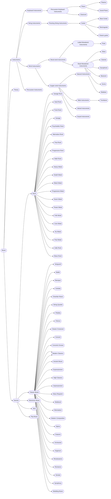

# Music domain hierarchy

```mermaid
graph LR;
  Music([Music])
    Music -->Instruments([Instruments])
    Music -->Theory([Theory])
    Music -->Genres([Genres])

      %% Instruments
        Instruments --> Keyboard_Instruments([Keyboard Instruments])
        Instruments --> String_Instruments([String Instruments])
        Instruments --> Wind_Instruments([Wind Instruments])
        Instruments --> Percussion_Instruments([Percussion Instruments])
      

        %% Keboard
          Keyboard_Instruments --> Percussion_Keyboard_Instruments([Percussion-Keyboard Instruments])
          
            Percussion_Keyboard_Instruments --> Piano([Piano])
            Percussion_Keyboard_Instruments --> Clavicord([Clavicord])

            Piano --> Pianino([Pianino])
            Piano --> Grand_Piano([Grand Piano])


        %%String
          String_Instruments --> Plucking_String_Instruments([Plucking String Instruments])

            Plucking_String_Instruments --> Guitar([Guitar])

              Guitar --> Bass_Guitar([Bass Guitar])
              Guitar --> Electro_Guitar([Electroguitar])
              Guitar --> Classic_Guitar([Classic guitar])
        
        %% Wind
          Wind_Instruments --> Wood_Wind_Instruments([Wood wind instruments])
          Wind_Instruments --> Copper_Wind_Instruments([Copper wind instruments])
            %% Wood
              Wood_Wind_Instruments --> Labial_Woodwind_Instruments([Labial Woodwind Instruments])
              Wood_Wind_Instruments --> Reed_Woodwind_Instruments([Reed Woodwind Instruments])

                Labial_Woodwind_Instruments --> Flute([Flute])
                
                Reed_Woodwind_Instruments --> Oboe([Oboe])
                Reed_Woodwind_Instruments --> Clarinet([Clarinet])
                Reed_Woodwind_Instruments --> Saxophone([Saxophone])
                Reed_Woodwind_Instruments --> Bassoon([Bassoon])
                Reed_Woodwind_Instruments --> Zurna([Zurna])
                Reed_Woodwind_Instruments --> Balaban([Balaban])
            %% Copper
              Copper_Wind_Instruments --> Natural_Copper_Instruments([Natural Instruments])
              Copper_Wind_Instruments --> Slide_Copper_Instruments([Slide Instruments])
              Copper_Wind_Instruments --> Valve_Copper_Instruments([Valved Instruments])
              Copper_Wind_Instruments --> Keyed_Copper_Instruments([Keyed Instruments])

                Slide_Copper_Instruments --> Trombone([Trombone])


        %% Percussion

      %% Genres
        Genres --> Rock([Rock])
        Genres --> Classic_Music([Classic Music])
        Genres --> Electronic_Music([Electronic Music])
        Genres --> Jazz([Jazz])
        Genres --> Pop_Music([Pop Music])

        %% Rock
          Rock --> Garage_Rock([Garage Rock])
          Rock --> Hard_Rock([Hard Rock])
          Rock --> Punk_Rock([Punk Rock])
          Rock --> Grunge([Garage])
          Rock --> Psychedelic_Rock([Psychedelic Rock])
          Rock --> Alternative_Rock([Alternative Rock])
          Rock --> Post_Rock([Post Rock])
          Rock --> Progressive_Rock([Progressive Rock])
          Rock --> Math_Rock([Math Rock])
          Rock --> Heavy_Metal([Heavy Metal])
          Rock --> Death_Metal([Death Metal])
          Rock --> Black_Metal([Black Metal])
          Rock --> Progressive_Metal([Progressive Metal])
          Rock --> Doom_Metal([Doom Metal])
          Rock --> Power_Metal([Power Metal])
          Rock --> Folk_Metal([Folk Metal])
          Rock --> Core_Metal([Core Metal])
          Rock --> Nu_Metal([Nu Metal])
          Rock --> Post_Metal([Post Metal])
          Rock --> Indie_Rock([Indie Rock])
          Rock --> Blues_Rock([Blues Rock])

        %% Classic
          Classic_Music --> Vanguard([Vanguard])
          Classic_Music --> Ballet([Ballet])
          Classic_Music --> Baroque([Baroque])
          Classic_Music --> Cantata([Cantata])
          Classic_Music --> Chamber_Music([Chamber Music])
          Classic_Music --> String_Quartet([String Quartet])
          Classic_Music --> Singing([Singing])
          Classic_Music --> Chorus([Chorus])
          Classic_Music --> Classic_Crossover([Classic Crossover])
          Classic_Music --> Concert([Concert])
          Classic_Music --> Concerto_Grosso([Concerto Grosso])
          Classic_Music --> Modern_Classics([Modern Classics])
          Classic_Music --> Ancient_Music([Ancient Music])
          Classic_Music --> Expressionism([Expressionism])
          Classic_Music --> High_Classics([High Classics])
          Classic_Music --> Impressionism([Impressionism])
          Classic_Music --> Mass_Requiem([Mass Requiem])
          Classic_Music --> Medieval([Medieval])
          Classic_Music --> Minimalism([Minimalism])
          Classic_Music --> Modern_Composition([Modern Composition])
          Classic_Music --> Modern_Classics([Modern Classics])
          Classic_Music --> Opera([Opera])
          Classic_Music --> Oratorio([Oratorio])
          Classic_Music --> Orchestral([Orchestral])
          Classic_Music --> Organum([Organum])
          Classic_Music --> Renaissance([Renaissance])
          Classic_Music --> Romance([Romance])
          Classic_Music --> Sonata([Sonata])
          Classic_Music --> Symphony([Symphony])
          Classic_Music --> Wedding_Music([Wedding Music])
   
```
