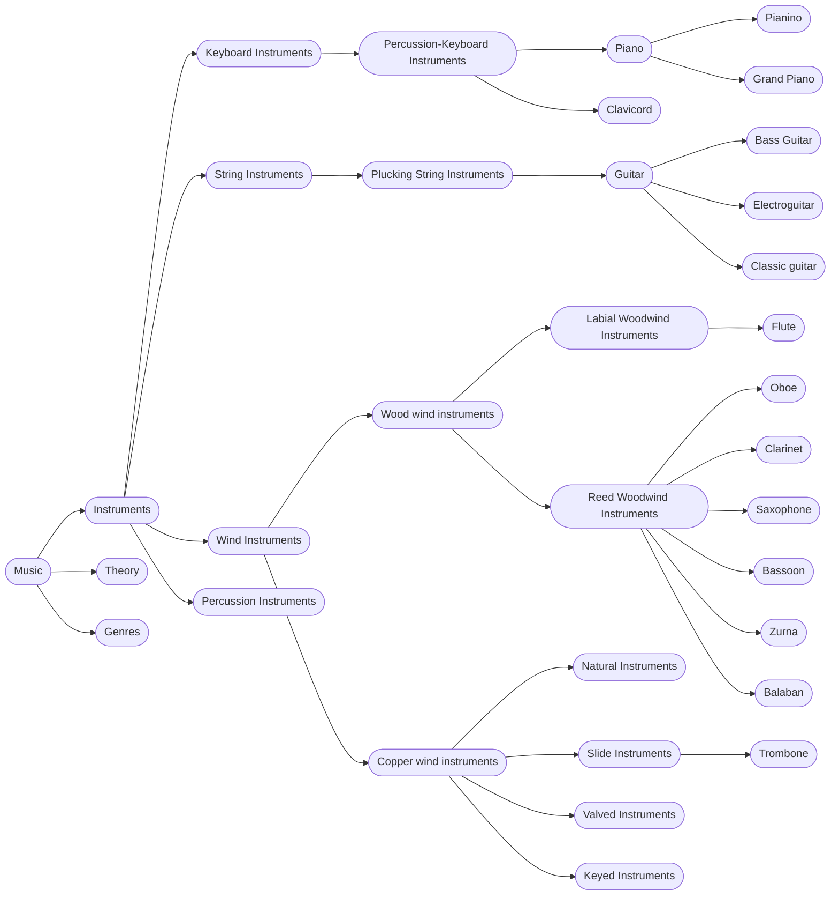

# Music domain hierarchy

```mermaid
graph LR;
  Music([Music])
    Music -->Instruments([Instruments])
    Music -->Theory([Theory])
    Music -->Genres([Genres])

      %% Instruments
        Instruments --> Keyboard_Instruments([Keyboard Instruments])
        Instruments --> String_Instruments([String Instruments])
        Instruments --> Wind_Instruments([Wind Instruments])
        Instruments --> Percussion_Instruments([Percussion Instruments])
      

        %% Keboard
          Keyboard_Instruments --> Percussion_Keyboard_Instruments([Percussion-Keyboard Instruments])
          
            Percussion_Keyboard_Instruments --> Piano([Piano])
            Percussion_Keyboard_Instruments --> Clavicord([Clavicord])

            Piano --> Pianino([Pianino])
            Piano --> Grand_Piano([Grand Piano])


        %%String
          String_Instruments --> Plucking_String_Instruments([Plucking String Instruments])

            Plucking_String_Instruments --> Guitar([Guitar])

              Guitar --> Bass_Guitar([Bass Guitar])
              Guitar --> Electro_Guitar([Electroguitar])
              Guitar --> Classic_Guitar([Classic guitar])
        
        %% Wind
          Wind_Instruments --> Wood_Wind_Instruments([Wood wind instruments])
          Wind_Instruments --> Copper_Wind_Instruments([Copper wind instruments])
            %% Wood
              Wood_Wind_Instruments --> Labial_Woodwind_Instruments([Labial Woodwind Instruments])
              Wood_Wind_Instruments --> Reed_Woodwind_Instruments([Reed Woodwind Instruments])

                Labial_Woodwind_Instruments --> Flute([Flute])
                
                Reed_Woodwind_Instruments --> Oboe([Oboe])
                Reed_Woodwind_Instruments --> Clarinet([Clarinet])
                Reed_Woodwind_Instruments --> Saxophone([Saxophone])
                Reed_Woodwind_Instruments --> Bassoon([Bassoon])
                Reed_Woodwind_Instruments --> Zurna([Zurna])
                Reed_Woodwind_Instruments --> Balaban([Balaban])
            %% Copper
              Copper_Wind_Instruments --> Natural_Copper_Instruments([Natural Instruments])
              Copper_Wind_Instruments --> Slide_Copper_Instruments([Slide Instruments])
              Copper_Wind_Instruments --> Valve_Copper_Instruments([Valved Instruments])
              Copper_Wind_Instruments --> Keyed_Copper_Instruments([Keyed Instruments])

                Slide_Copper_Instruments --> Trombone([Trombone])


        %% Percussion
      
```
