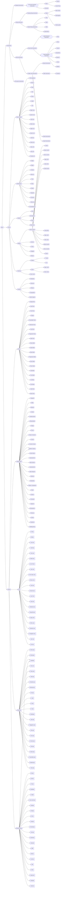

# Music domain hierarchy

```mermaid
graph LR;
  Music([Music])
    Music -->Instruments([Instruments])
    Music -->Theory([Theory])
    Music -->Genres([Genres])

      %% Instruments
        Instruments --> Keyboard_Instruments([Keyboard Instruments])
        Instruments --> String_Instruments([String Instruments])
        Instruments --> Wind_Instruments([Wind Instruments])
        Instruments --> Percussion_Instruments([Percussion Instruments])
      

        %% Keboard
          Keyboard_Instruments --> Percussion_Keyboard_Instruments([Percussion-Keyboard Instruments])
          
            Percussion_Keyboard_Instruments --> Piano([Piano])
            Percussion_Keyboard_Instruments --> Clavicord([Clavicord])

            Piano --> Pianino([Pianino])
            Piano --> Grand_Piano([Grand Piano])


        %%String
          String_Instruments --> Plucking_String_Instruments([Plucking String Instruments])
          String_Instruments --> Bowed_String_Instruments([Bowed String Instruments])

            Plucking_String_Instruments --> Guitar([Guitar])

              Guitar --> Bass_Guitar([Bass Guitar])
              Guitar --> Electro_Guitar([Electroguitar])
              Guitar --> Classic_Guitar([Classic guitar])

            Bowed_String_Instruments --> Viola([Viola])
            Bowed_String_Instruments --> Violin([Violin])
            Bowed_String_Instruments --> Cello([Cello])
            Bowed_String_Instruments --> Double_Bass([Double Bass])
        
        %% Wind
          Wind_Instruments --> Wood_Wind_Instruments([Wood wind instruments])
          Wind_Instruments --> Copper_Wind_Instruments([Copper wind instruments])
            %% Wood
              Wood_Wind_Instruments --> Labial_Woodwind_Instruments([Labial Woodwind Instruments])
              Wood_Wind_Instruments --> Reed_Woodwind_Instruments([Reed Woodwind Instruments])

                Labial_Woodwind_Instruments --> Flute([Flute])
                
                Reed_Woodwind_Instruments --> Oboe([Oboe])
                Reed_Woodwind_Instruments --> Clarinet([Clarinet])
                Reed_Woodwind_Instruments --> Saxophone([Saxophone])
                Reed_Woodwind_Instruments --> Bassoon([Bassoon])
                Reed_Woodwind_Instruments --> Zurna([Zurna])
                Reed_Woodwind_Instruments --> Balaban([Balaban])
            %% Copper
              Copper_Wind_Instruments --> Natural_Copper_Instruments([Natural Instruments])
              Copper_Wind_Instruments --> Slide_Copper_Instruments([Slide Instruments])
              Copper_Wind_Instruments --> Valve_Copper_Instruments([Valved Instruments])
              Copper_Wind_Instruments --> Keyed_Copper_Instruments([Keyed Instruments])

                Slide_Copper_Instruments --> Trombone([Trombone])


        %% Percussion

          
      %% Theory
        Theory --> Music_notation([Music notation])
        Theory --> Analysis([Analysis])
        Theory --> Performance([Performance])
        Theory --> Rhythm([Rhythm])
        Theory --> Melody([Melody])
        Theory --> Harmony([Harmony])

        %% Music_notation
          Music_notation --> time_signature([Time signature])
          Music_notation --> natural([Natural])
          Music_notation --> sharp([Sharp])
          Music_notation --> flat([Flat])
          Music_notation --> tempo([Tempo])
          Music_notation --> legato([Legato])
          Music_notation --> trill([Trill])
          Music_notation --> eighth_note([Eighth note])
          Music_notation --> quarter_note([Quarter note])
          Music_notation --> half_note([Half note])
          Music_notation --> whole_note([Whole note])
          Music_notation --> eighth_rest([Eighth rest])
          Music_notation --> quarter_rest([Quarter rest])
          Music_notation --> half_rest([Half rest])
          Music_notation --> whole_rest([Whole rest])
          Music_notation --> bass_clef([Bass clef])
          Music_notation --> alto_clef([Alto clef])
          Music_notation --> tremble_clef([Tremble clef])

        %% Performance
          Performance --> adagio([Adagio])
          Performance --> allegro([Allegro])
          Performance --> andante([Andante])
          Performance --> ritenuto([Ritenuto])
          Performance --> forte([Forte])
          Performance --> piano([Piano])
          Performance --> vibrato([Vibrato])
          Performance --> flageolet([Flageolet])
          Performance --> pizzicato([Pizzicato])
          Performance --> staccato([Staccato])
          Performance --> accompaniment([Accompaniment])

        %% Rhythm
          Rhythm --> bar([Bar])
          Rhythm --> syncopation([Syncopation])
          Rhythm --> pickup([Pickup])
          Rhythm --> metronome([Metronome])

        %% Melody
          Melody --> music_interval([Music interval])
          %% Music interval
            music_interval --> unison([Unison])
            music_interval --> major_second([Major second])
            music_interval --> minor_second([Minor second])
            music_interval --> major_third([Major third])
            music_interval --> minor_third([Minor third])
            music_interval --> perfect_fourth([Perfect fourth])
            music_interval --> perfect_fifth([Perfect fifth])
            music_interval --> major_sisth([Major sisth])
            music_interval --> minor_sixth([Minor sixth])
            music_interval --> major_seventh([Major seventh])
            music_interval --> minor_seventh([Minor seventh])
            music_interval --> octave([Octave])
          Melody --> gamma([Gamma])
          Melody --> timbre([Timbre])
          Melody --> arpeggio([Arpeggio])
          Melody --> reprise([Reprise])

        %% Harmony
          Harmony --> tonality([Tonality])
          tonality --> C_major([C major])
          tonality --> D_minor([D m])
          Harmony --> chord([Chord])
          Harmony --> fourth_chord([Fourth chord])
          %% Chord
            chord --> major_chord([Major chord])
            chord --> minor_chord([Minor chord])

        %% Analysis
          Analysis --> modulation([Modulation])
          Analysis --> structure([Structure])
          Analysis --> rhetoric([Rhetoric])
          Analysis --> transposition([Transposition])
          Analysis --> rhythmic_figures([hythmic figures])


    


      %% Genres
        Genres --> Rock([Rock])
        Genres --> Classic_Music([Classic Music])
        Genres --> Electronic_Music([Electronic Music])
        Genres --> Jazz([Jazz])
        Genres --> Pop_Music([Pop Music])

        %% Rock
          Rock --> Garage_Rock([Garage Rock])
          Rock --> Hard_Rock([Hard Rock])
          Rock --> Punk_Rock([Punk Rock])
          Rock --> Grunge([Garage])
          Rock --> Psychedelic_Rock([Psychedelic Rock])
          Rock --> Alternative_Rock([Alternative Rock])
          Rock --> Post_Rock([Post Rock])
          Rock --> Progressive_Rock([Progressive Rock])
          Rock --> Math_Rock([Math Rock])
          Rock --> Heavy_Metal([Heavy Metal])
          Rock --> Death_Metal([Death Metal])
          Rock --> Black_Metal([Black Metal])
          Rock --> Progressive_Metal([Progressive Metal])
          Rock --> Doom_Metal([Doom Metal])
          Rock --> Power_Metal([Power Metal])
          Rock --> Folk_Metal([Folk Metal])
          Rock --> Core_Metal([Core Metal])
          Rock --> Nu_Metal([Nu Metal])
          Rock --> Post_Metal([Post Metal])
          Rock --> Indie_Rock([Indie Rock])
          Rock --> Blues_Rock([Blues Rock])

        %% Classic
          Classic_Music --> Vanguard([Vanguard])
          Classic_Music --> Ballet([Ballet])
          Classic_Music --> Baroque([Baroque])
          Classic_Music --> Cantata([Cantata])
          Classic_Music --> Chamber_Music([Chamber Music])
          Classic_Music --> String_Quartet([String Quartet])
          Classic_Music --> Singing([Singing])
          Classic_Music --> Chorus([Chorus])
          Classic_Music --> Classic_Crossover([Classic Crossover])
          Classic_Music --> Concert([Concert])
          Classic_Music --> Concerto_Grosso([Concerto Grosso])
          Classic_Music --> Modern_Classics([Modern Classics])
          Classic_Music --> Ancient_Music([Ancient Music])
          Classic_Music --> Expressionism([Expressionism])
          Classic_Music --> High_Classics([High Classics])
          Classic_Music --> Impressionism([Impressionism])
          Classic_Music --> Mass_Requiem([Mass Requiem])
          Classic_Music --> Medieval([Medieval])
          Classic_Music --> Minimalism([Minimalism])
          Classic_Music --> Modern_Composition([Modern Composition])
          Classic_Music --> Modern_Classics([Modern Classics])
          Classic_Music --> Opera([Opera])
          Classic_Music --> Oratorio([Oratorio])
          Classic_Music --> Orchestral([Orchestral])
          Classic_Music --> Organum([Organum])
          Classic_Music --> Renaissance([Renaissance])
          Classic_Music --> Romance([Romance])
          Classic_Music --> Sonata([Sonata])
          Classic_Music --> Symphony([Symphony])
          Classic_Music --> Wedding_Music([Wedding Music])

        %% Jazz
          Jazz --> Swing(Swing)
          Jazz --> Bebop(Bebop)
          Jazz --> Cool_Jazz(Cool Jazz)
          Jazz --> Hard_Bop(Hard bop)
          Jazz --> Free_Jazz(Free Jazz)
          Jazz --> Modal_Jazz(Modal Jazz)
          Jazz --> Fusion_Jazz(Jazz Fusion)
          Jazz --> Latin_Jazz(Latin Jazz)
          Jazz --> Afro_Cuban_Jazz(Afro Cuban Jazz)
          Jazz --> Bossa_nova(Bossa nova)
          Jazz --> Acid_Jazz(Acid Jazz)
          Jazz --> Smooth_Jazz(Smooth Jazz)
          Jazz --> Jazz_funk(Jazz Funk)
          Jazz --> Soul_Jazz(Soul Jazz)
          Jazz --> Dixieland(Dixieland Jazz)
          Jazz --> Swing_revival(Swing Revival)
          Jazz --> Gypsy_Jazz(Gypsy Jazz)
          Jazz --> Ethno_Jazz(Ethno Jazz)
          Jazz --> Chamber_Jazz(Chamber Jazz)
          Jazz --> Avantgarde_Jazz(Avantgarde Jazz)
          Jazz --> Jazz_rap(Jazz rap)
          Jazz --> Nu_Jazz(Nu Jazz)

        %% Pop Music
          Pop_Music --> Dance_Pop(Dance pop)
          Pop_Music --> Electropop(Electropop)
          Pop_Music --> Synthpop(Synthpop)
          Pop_Music --> Pop_Rock(Pop rock)
          Pop_Music --> Power_Pop(Power pop)
          Pop_Music --> Indie_Pop(Indie pop)
          Pop_Music --> Chamber_Pop(Chamber pop)
          Pop_Music --> Baroque_Pop(Baroque pop)
          Pop_Music --> Art_Pop(Art pop)
          Pop_Music --> J-Pop(J-pop)
          Pop_Music --> K-Pop(K-pop)
          Pop_Music --> C-Pop(C-pop)
          Pop_Music --> Mandopop(Mandopop)
          Pop_Music --> Latin_Pop(Latin pop)
          Pop_Music --> Reggaeton_Pop(Reggaeton pop)
          Pop_Music --> Afro_Pop(Afro pop)
          Pop_Music --> Euro_Pop(Euro pop)
          Pop_Music --> Country_Pop(Country pop)
          Pop_Music --> Folk_Pop(Folk pop)
          Pop_Music --> Dream_Pop(Dream pop)
          Pop_Music --> Psychedelic_Pop(Psychedelic pop)
          Pop_Music --> Sophisti-Pop(Sophisti-pop)
          Pop_Music --> Teen_Pop(Teen pop)

        %% Electronic Music
          Electronic_Music --> House(House)
          Electronic_Music --> Techno(Techno)
          Electronic_Music --> Trance(Trance)
          Electronic_Music --> Breakbeat(Breakbeat)
          Electronic_Music --> Jungle(Jungle)
          Electronic_Music --> Drum_and_Bass(Drum and bass)
          Electronic_Music --> Dubstep(Dubstep)
          Electronic_Music --> Garage(Garage)
          Electronic_Music --> Grime(Grime)
          Electronic_Music --> Ambient(Ambient)
          Electronic_Music --> Downtempo(Downtempo)
          Electronic_Music --> Trip_Hop(Trip hop)
          Electronic_Music --> Synthwave(Synthwave)
          Electronic_Music --> Industrial(Industrial)
          Electronic_Music --> EBM(EBM)
          Electronic_Music --> Synthpop(Synthpop)
          Electronic_Music --> Electro(Electro)
          Electronic_Music --> Nu-Disco(Nu-disco)
          Electronic_Music --> IDM(IDM)
          Electronic_Music --> Glitch(Glitch)
          Electronic_Music --> Vaporwave(Vaporwave)
          Electronic_Music --> Hardstyle(Hardstyle)
          Electronic_Music --> Hardcore(Hardcore)

   
```
We're cool!
